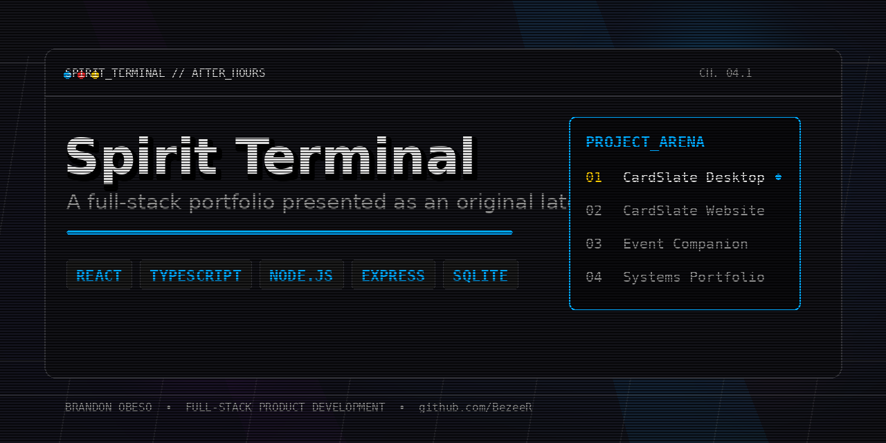

<p align="center">
  
</p>

<h1 align="center">Spirit Terminal: After Hours</h1>

<p align="center">
  A full-stack portfolio that presents product case studies inside an original late-night supernatural tournament broadcast interface.
</p>

<p align="center">
  <a href="https://github.com/BezeeR/spirit-terminal-portfolio/actions/workflows/ci.yml"></a>
  
  
  
  
</p>

## Overview

Spirit Terminal is a responsive portfolio built around **CardSlate**, **TCG Buds**, **StratBoard**, and future product systems. Instead of a long template-style page, visitors move through a project arena using project tabs, keyboard controls, swipe navigation, and animated broadcast transitions.

The visual direction combines brutalist tournament architecture, VHS texture, rain, fog, cyan energy, and a procedural lo-fi radio. All artwork, effects, interface elements, and audio are original; the project does not redistribute anime screenshots, television-network branding, character art, voice clips, or copyrighted music.

## Featured work

### CardSlate Desktop
A local-first trading-card inventory, pricing, and convention-sales application built with Electron, React, TypeScript, SQLite, and Supabase.

### CardSlate Website
The public marketing and release experience for CardSlate, including product storytelling, private-beta downloads, support information, and responsive presentation.

### Event Companion
A mobile event workflow for inventory access, convention checkout, offline sale recovery, card intake, and synchronized event controls.

### TCG Buds Storefront
An authorized bright-first storefront concept for a competitive One Piece TCG creator brand. It connects official main-channel, gameplay, and Shorts content with a responsive catalog, owner-curated Deck Lab, persistent demo cart, accessible support routes, automated browser coverage, and a Shopify Storefront API provider boundary. The portfolio entry links to the live authorized demo at `https://tcgbuds.bezeer.app/`. `VITE_TCG_BUDS_URL` can override that destination without changing source code.

### StratBoard
A local-first Counter-Strike 2 tactical planner built with Next.js, React Konva, Zustand, and Zod. It supports real radar maps, multi-step execute presentation, browser-saved playbooks, favorites, search, and versioned JSON backup import/export. The portfolio uses a real StratBoard product preview and falls back to its GitHub repository until `VITE_STRATBOARD_URL` is configured.

## Highlights

- Project-switching workspace designed to reduce excessive scrolling
- Responsive layouts for phones, tablets, laptops, desktops, and ultrawide displays
- Keyboard, touch, swipe, and pointer navigation
- Original procedural lo-fi audio using the Web Audio API
- Adaptive Canvas effects that reduce work on mobile and pause in hidden tabs
- Reduced-motion, increased-contrast, focus, and skip-navigation support
- Express API with request validation, rate limiting, and SQLite persistence
- Bundled project-data fallback when the API is unavailable
- GitHub Actions build verification on pushes and pull requests

## Technology

| Layer | Technology |
| --- | --- |
| Interface | React 19, TypeScript, Vite |
| Styling | Custom responsive CSS |
| Server | Node.js, Express |
| Data | Node built-in SQLite |
| Effects | Canvas, Web Audio API |
| Quality | TypeScript build, GitHub Actions CI |

## Architecture

```text
Browser
├── React project arena
├── Responsive visual system
├── Canvas broadcast effects
├── Procedural Web Audio soundtrack
└── Contact console
        │
        ▼
Express API
├── Project data endpoint
├── Contact validation
├── Rate limiting
└── SQLite message storage
```

## Run locally

Node.js **22.5 or newer** is required.

```bash
npm install
npm run dev
```

- Client: `http://localhost:5173`
- API: `http://localhost:5174`

## Production

To point project cards at their live deployments, set the relevant Vite variables:

```env
VITE_TCG_BUDS_URL=https://tcgbuds.bezeer.app/
VITE_STRATBOARD_URL=https://stratboard-six.vercel.app/
```

The live StratBoard deployment is also built into the project data as a safe fallback. `VITE_STRATBOARD_URL` remains an optional deployment override. Then rebuild and deploy the portfolio:

```bash
npm run build
npm run server
```

The Node production server serves the compiled portfolio and its `/api` endpoints.

## Useful scripts

| Command | Purpose |
| --- | --- |
| `npm run dev` | Start the React client and Node API together |
| `npm run build` | Type-check and create the production client |
| `npm run preview` | Preview the Vite production output |
| `npm run server` | Run the production Express server |

## Project structure

```text
src/
├── components/        Visual effects, audio, transitions, and mockups
├── data/projects.ts   Portfolio case-study content
├── App.tsx            Project arena and contact experience
└── styles.css         Layout, palette, animation, and responsive system

server/
└── index.ts           Express API and SQLite persistence

.github/workflows/
└── ci.yml             Automated production-build check
```

## Design and quality notes

- [Design system](DESIGN-SYSTEM.md)
- [Responsive and reliability QA](RESPONSIVE-QA.md)
- [v0.4 changelog](CHANGELOG-v0.4.md)
- [StratBoard integration changelog](CHANGELOG-stratboard.md)
- [GitHub Desktop setup](GITHUB-DESKTOP-SETUP.md)

## Hosting

GitHub hosts the source repository and runs the build workflow. The complete application requires a Node-capable host because GitHub Pages cannot run the Express and SQLite backend. A static-only deployment would require replacing the contact endpoint with a hosted form or serverless service.

## Contact

- GitHub: [@BezeeR](https://github.com/BezeeR)
- Discord: `bezeer`
- Discord user ID: `171078389166243840`

## Project status

Active portfolio development. CardSlate is currently represented as a feature-frozen private-beta product while real-user reliability testing is underway.

## Usage

No open-source license is included at this stage. The source remains publicly viewable if the repository is published publicly, but standard copyright protection applies unless a license is added later.
